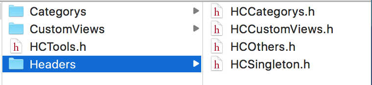
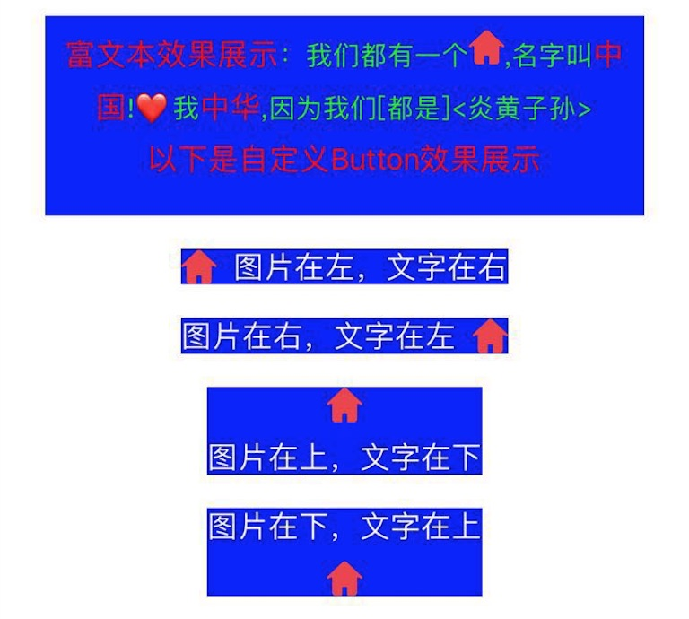

# HCTools
在介绍此框架的具体内容之前，先大致介绍一下此框架的由来。转眼做iOS开发也有几年了，工作中也踩过各种各样的坑，写过无数的demo,也总结了不少东西，但是一直都是自己和身边的朋友在自己公司的项目中使用，传播方式也仅限于利用QQ、微信，从来也没想着公开出来。后来的感慨就是，之前明明已经写过的许多功能，后来再次用到的时候却发现有很多都找不到了，还得重复去写，也是有感于此吧，所以就想把自己平时总结出来的一些方法和功能集中到一起，让自己和朋友们一起进行完善，在需要的时候直接拿来使用，不会担心丢失，而且经过众多大牛，而不是仅仅自己的力量进行完善，可以让这些功能更加的强大，更加的强健，这也就是此项目的意义和由来。
## 1.目录结构

* HCTools.h:所有头文件的集合,如果需要使用该框架中的所有功能,进入该文件即可
* Categorys:一些比较常用控件的功能拓展,比如NSString分类里面有检测手机号和身份证号的方法,
UIView里面有针对快速设置和获取frame的各个值得方法,left,right,top,bottom,UItextView分类里面有直接添加placeholder的方法等等,具体的可以去各个头文件里面趣看
* CustomViews:封装的一些比较常用的控件,比如针对UIButton的二次封装,拓展系统UIButton只能图片在左边,文字在右边的不足,方便的做出图片在上面,文字在下面以及图片在右边,文字在左边等等这些常用的需求,还比如里面有很方便的设置富文本的工具
* Headers里面放了各个模块的头文件集,使用场景是如果你不想使用该框架的所有功能,仅仅想要使用其中的分类,那么你只需要引用HCCategorys.h,而不必引入HCTools.h
## 2.集成方法
`$ pod 'HCTools'`
## 3.部分代码及其对应的效果展示
```
//设置富文本label
HCAttributeLabel *label = [[HCAttributeLabel alloc]initWithFrame:CGRectMake(100, 100, 360, 120)];
label.text = @"<富文本效果展示>：我们都有一个[test],名字叫<中国>!❤️我<中华>,因为我们\\[都是\\]\\<炎黄子孙\\>\n<以下是自定义Button效果展示>";
label.highlightFont = [UIFont systemFontOfSize:18];
label.textColor = [UIColor greenColor];
label.highlightColor = [UIColor redColor];
label.backgroundColor = [UIColor blueColor];
label.font = [UIFont systemFontOfSize:16];
label.lineSpacing = 10;
label.center = self.view.center;
label.textAlignment = NSTextAlignmentCenter;
label.HighlightAction = ^(NSString *string){
NSLog(@"string:%@",string);
};
[self.view addSubview:label];

//创建一个图片在左，文字在右边，图片和文字距离为10，上边距离label为20的Button
HCCustomButton *button1 = [HCCustomButton customButtonWithType:HCCustomButtonTypeDefault];
[button1 setTitle:@"图片在左，文字在右" forState:UIControlStateNormal];
button1.padding = 10;
[button1 setImage:[UIImage imageNamed:@"test"] forState:UIControlStateNormal];
button1.backgroundColor = [UIColor blueColor];
button1.top = label.bottom + 20;
button1.centerX = self.view.centerX;
[self.view addSubview:button1];

//创建一个图片在右，文字在左，图片和文字距离为10，上边距离button1为20的Button
HCCustomButton *button2 = [HCCustomButton customButtonWithType:HCCustomButtonTypeImageOnRight];
[button2 setTitle:@"图片在右，文字在左" forState:UIControlStateNormal];
button2.padding = 10;
[button2 setImage:[UIImage imageNamed:@"test"] forState:UIControlStateNormal];
button2.backgroundColor = [UIColor blueColor];
button2.top = button1.bottom + 20;
button2.centerX = self.view.centerX;
[self.view addSubview:button2];

//创建一个图片在上，文字在下，图片和文字距离为10，上边距离button2为20的Button
HCCustomButton *button3 = [HCCustomButton customButtonWithType:HCCustomButtonTypeImageOnTop];
[button3 setTitle:@"图片在上，文字在下" forState:UIControlStateNormal];
button3.padding = 10;
[button3 setImage:[UIImage imageNamed:@"test"] forState:UIControlStateNormal];
button3.backgroundColor = [UIColor blueColor];
button3.top = button2.bottom + 20;
[self.view addSubview:button3];
button3.centerX = self.view.centerX;

//创建一个图片在下，文字在上，图片和文字距离为10，上边距离button3为40的Button
HCCustomButton *button4 = [HCCustomButton customButtonWithType:HCCustomButtonTypeImageOnBottom];
[button4 setTitle:@"图片在下，文字在上" forState:UIControlStateNormal];
button4.padding = 10;
[button4 setImage:[UIImage imageNamed:@"test"] forState:UIControlStateNormal];
button4.backgroundColor = [UIColor blueColor];
button4.top = button3.bottom + 20;
button4.centerX = self.view.centerX;
[self.view addSubview:button4];
```



